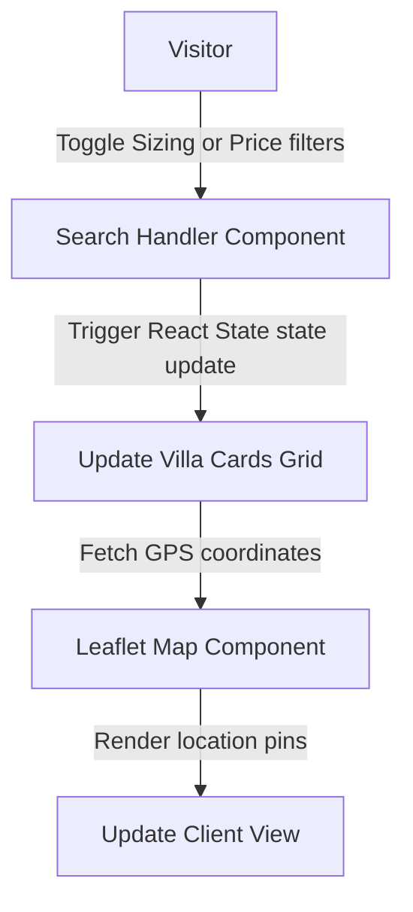

# Villa Real Estate Portal: Premium Residential Property Listings

<div align="center">
  
</div>

<div align="center">
     
</div>

بوابة **الفيلا العقارية** هي واجهة تفاعلية مخصصة للبحث واستعراض الفلل السكنية والمنتجعات الفاخرة، تتميز بتصميمات بصرية راقية وفلاتر تصفية متقدمة لتسهيل العثور على العقار السكني الأمثل.

This repository holds the React frontend directory and user interface for the **Villa Real Estate Directory**. Featuring detailed villa specification charts, coordinates map tracking, and smooth transitions.

---

## 🧬 User Search & Filter Flow

The frontend handles search updates and map location adjustments:



---

## 🛠️ Technology Stack & Assets

*   **Framework**: **React 18** + **Vite**.
*   **Mapping**: **Leaflet** map integrations.
*   **Design**: **TailwindCSS** design systems.

---

## 📂 Repository Module Layout

```text
villa-real-estate-react/
├── src/
│   ├── components/      # VillaCard, MapWidget, FilterBar
│   ├── App.jsx          # Portal root view
│   └── main.jsx         # Render entry point
├── package.json         # Node metadata
└── README.md            # System documentation
```

---

## ⚡ Local Setup & Run
```bash
git clone https://github.com/Sayed-Herzallah/villa-real-estate-react.git
cd villa-real-estate-react
npm install
npm run dev
```

---

## 📄 License
Licensed under the **MIT License**.
